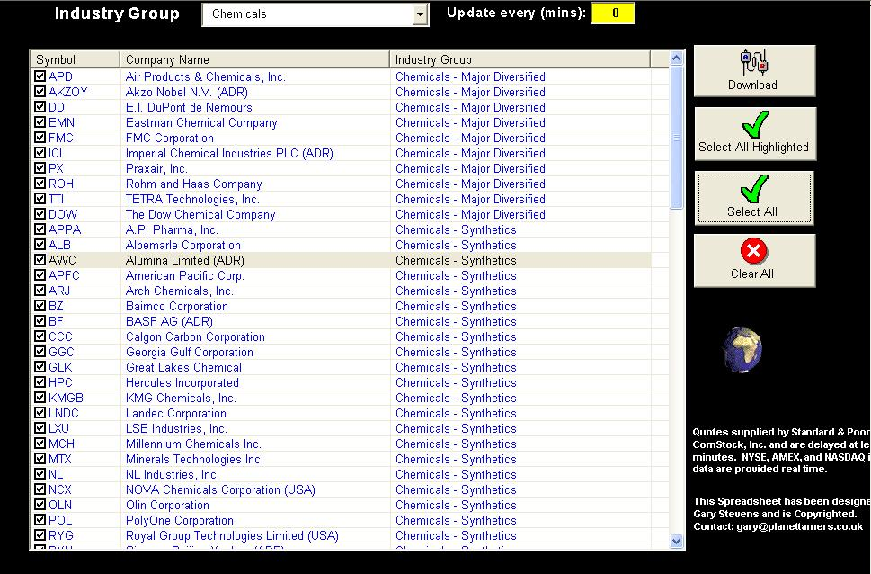



## Stock Quotes

### Description

This example Excel spreadsheet shows how to get live datafeeds for Stock using Excel Querys. I have password protected the workbook, but I will give that to you, so you can see the 'Protection' functionality in use. (Password = 'stockquotes'). There are hidden sheets that contain the Listings for each industry sector (this is set at startup of the workbook), but these could be parked in a database such as Access or SQL if you liked. I have used a ListView to manage the stocks that you need quotes on. Anyway, I hope that this is useful! It could be adapted for other markets, which is why a database of sectors/markets would be handy.
 
### More Info
 
The latest stock quotes for the stocks that you have selected.

A larger understanding (and brain!?) of Excel and Query's.

             |
---                |---
**Submitted On**   |2005-01-20 11:01:02
**By**             |[GazMan](https://github.com/Planet-Source-Code/PSCIndex/blob/master/ByAuthor/gazman.md)
**Level**          |Intermediate
**User Rating**    |5.0 (20 globes from 4 users)
**Compatibility**  |VBA MS Excel
**Category**       |[Complete Applications](https://github.com/Planet-Source-Code/PSCIndex/blob/master/ByCategory/complete-applications__1-27.md)
**World**          |[Visual Basic](https://github.com/Planet-Source-Code/PSCIndex/blob/master/ByWorld/visual-basic.md)
**Archive File**   |[Stock\_Quot1842121202005\.zip](https://github.com/Planet-Source-Code/gazman-stock-quotes__1-58392/archive/master.zip)

